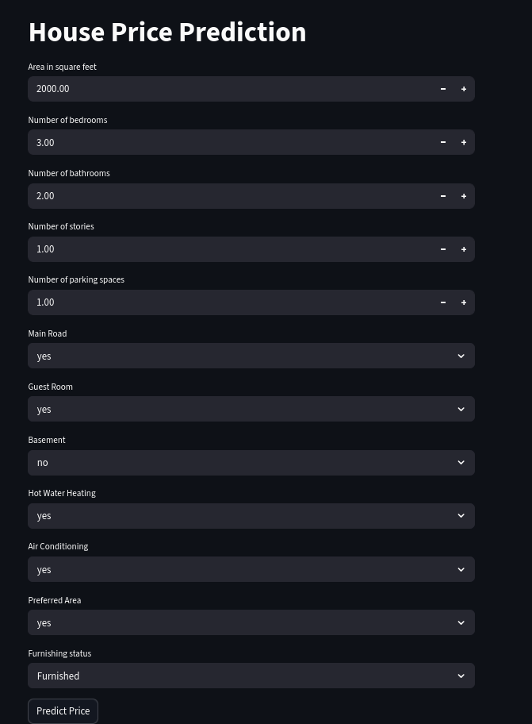
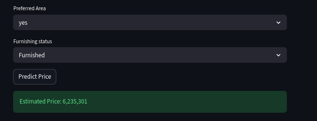

# 🏠 Housing Price Prediction Web App
### AIWebPredictionAppUsingPython
## 📸 Screenshots

### 🧾 Input Form

Below is the user input interface where features like area, bedrooms, and amenities are entered:



---

### 📊 Prediction Output

After clicking the **Predict** button, the model returns the estimated house price:




##  Overview

This project is a complete Machine Learning pipeline that predicts house prices based on input features.
It includes data preprocessing, model training, model comparison, and deployment using a Streamlit web application.

---

##  Tech Stack

* Python
* Pandas, NumPy
* Scikit-learn
* Joblib
* Streamlit

---

##  Dataset

* File: `Housing.csv`
* Features include:

  * Area
  * Bedrooms
  * Bathrooms
  * Stories
  * Parking
  * Furnishing status
  * Other categorical attributes

---

##  Workflow

### 1. Data Preprocessing

* Handling categorical variables using Label Encoding
* Feature scaling using StandardScaler

### 2. Model Training

Multiple models were trained:

* Linear Regression
* Decision Tree Regressor
* Random Forest Regressor

### 3. Model Evaluation

Models were evaluated using:

* MAE (Mean Absolute Error)
* RMSE (Root Mean Squared Error)
* R² Score

### 4. Best Model Selection

* The best model was selected based on highest R² score

### 5. Model Saving

* Saved using Joblib:

  * `model.pkl`
  * `scaler.pkl`
  * `encoders.pkl`

---

## Web Application
Built using Streamlit.

### Features:

* User-friendly input form
* Real-time prediction
* Displays estimated house price

---
##  Project Structure
```
housing-ml-app/
│
├── Housing.csv
├── Data_Preprocessing_Model_Training.ipynb
├── App.py
├── model.pkl
├── scaler.pkl
├── encoders.pkl
├── requirements.txt
├── .gitignore
└── README.md
```

---

## 🚀 How to Run

### 1. Clone Repository

```
git clone <your-repo-link>
cd housing-ml-app
```

### 2. Create Virtual Environment

```
python3 -m venv projectenv
source projectenv/bin/activate
```

### 3. Install Dependencies

```
pip install -r requirements.txt
```

### 4. Train Model (Optional)

Run the notebook:

```
jupyter notebook
```

### 5. Run Web App

```
streamlit run app.py
```

---

## 📈 Example Prediction

Input:

* Area: 2000 sq ft
* Bedrooms: 3
* Bathrooms: 2

Output:

* Predicted Price: ₹ 75,00,000 (example)

---

## ⚠️ Notes

* Ensure categorical inputs match training data (case-sensitive handled)
* Model files must exist before running the app

---

##  Future Improvements

* Replace LabelEncoder with OneHotEncoder
* Add feature importance visualization
* Deploy on cloud (Render / Streamlit Cloud)
* Add database integration

---

